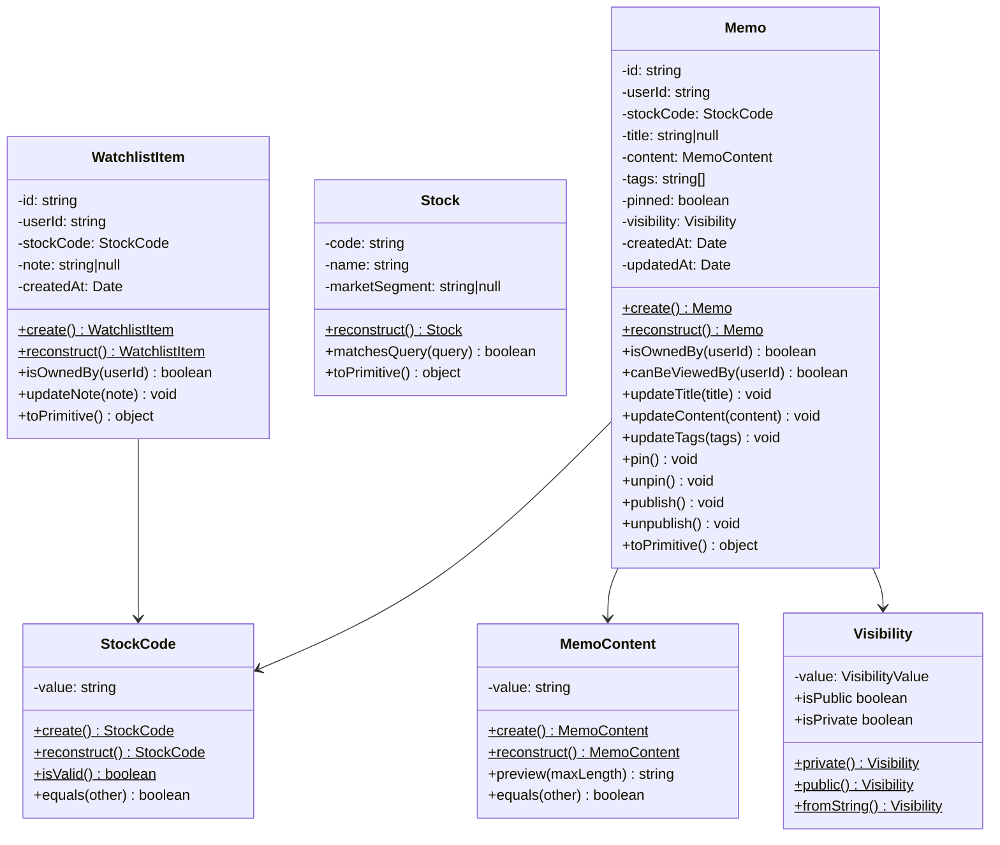

# ドメインモデル

## 概要

Stock Memoのドメイン層は、ビジネスルールの中核を担います。フレームワークや外部サービスに依存せず、純粋なTypeScriptで実装されています。

---

## エンティティ

エンティティは一意のIDで識別されるオブジェクトです。

### Memo（メモ）

ユーザーが銘柄に対して作成するメモを表します。

```typescript
class Memo {
    // 識別子
    id: string
    userId: string
    stockCode: StockCode  // 値オブジェクト
    
    // 属性
    title: string | null
    content: MemoContent  // 値オブジェクト
    tags: string[]
    pinned: boolean
    visibility: Visibility  // 値オブジェクト
    createdAt: Date
    updatedAt: Date
}
```

**ビジネスルール:**
- タグは最大10個まで
- 内容は1〜10,000文字
- 公開設定は `private`（非公開）または `public`（公開）

**主要メソッド:**

| メソッド | 説明 |
|---|---|
| `create()` | 新規メモ作成（ファクトリ） |
| `reconstruct()` | DBからの復元 |
| `isOwnedBy(userId)` | 所有者確認 |
| `canBeViewedBy(userId)` | 閲覧権限確認 |
| `updateTitle(title)` | タイトル更新 |
| `updateContent(content)` | 内容更新 |
| `updateTags(tags)` | タグ更新 |
| `pin()` / `unpin()` | ピン留め操作 |
| `publish()` / `unpublish()` | 公開設定変更 |
| `toPrimitive()` | プリミティブ型への変換 |

---

### Stock（銘柄）

日本株の銘柄情報を表します。銘柄コードで識別されます。

```typescript
class Stock {
    code: string          // 主キー（例: "7203"）
    name: string          // 銘柄名
    marketSegment: string | null  // 市場区分
    industry33Code: string | null
    industry33Name: string | null
    industry17Code: string | null
    industry17Name: string | null
    scaleCode: string | null
    scaleName: string | null
}
```

**主要メソッド:**

| メソッド | 説明 |
|---|---|
| `reconstruct()` | DBからの復元 |
| `matchesQuery(query)` | 検索クエリとのマッチング |
| `toPrimitive()` | プリミティブ型への変換 |

---

### WatchlistItem（ウォッチリストアイテム）

ユーザーがウォッチしている銘柄を表します。

```typescript
class WatchlistItem {
    id: string
    userId: string
    stockCode: StockCode
    note: string | null   // ウォッチ理由メモ
    createdAt: Date
}
```

**主要メソッド:**

| メソッド | 説明 |
|---|---|
| `create()` | 新規作成 |
| `reconstruct()` | DBからの復元 |
| `isOwnedBy(userId)` | 所有者確認 |
| `updateNote(note)` | メモ更新 |
| `toPrimitive()` | プリミティブ型への変換 |

---

## 値オブジェクト

値オブジェクトは不変（immutable）で、値で比較されるオブジェクトです。

### StockCode（銘柄コード）

4桁の数字で構成される銘柄コードを表します。

```typescript
class StockCode {
    value: string  // "1234" 形式
    
    static create(value: string): StockCode    // バリデーション付き
    static reconstruct(value: string): StockCode  // DB復元用
    static isValid(value: string): boolean
    
    equals(other: StockCode): boolean
}
```

**バリデーション:**
- 正規表現: `/^\d{4}$/`
- 4桁の数字のみ許可

---

### MemoContent（メモ内容）

メモの本文を表します。

```typescript
class MemoContent {
    value: string
    length: number
    
    static create(value: string): MemoContent
    static reconstruct(value: string): MemoContent
    
    preview(maxLength?: number): string
    equals(other: MemoContent): boolean
}
```

**バリデーション:**
- 最小長: 1文字
- 最大長: 10,000文字
- 前後の空白はトリム

---

### Visibility（公開設定）

メモの公開/非公開設定を表します。

```typescript
type VisibilityValue = "private" | "public"

class Visibility {
    value: VisibilityValue
    isPublic: boolean
    isPrivate: boolean
    
    static private(): Visibility
    static public(): Visibility
    static fromString(value: string): Visibility
    
    publish(): Visibility
    unpublish(): Visibility
    equals(other: Visibility): boolean
}
```

---

### DashboardStatistics（ダッシュボード統計）

ダッシュボードに表示する統計情報を表します。

```typescript
class DashboardStatistics {
    totalMemos: number
    totalStocks: number
    totalTags: number
    pinnedMemos: number
}
```

---

### TagUsage（タグ使用状況）

タグの使用回数を表します。

```typescript
class TagUsage {
    tag: string
    count: number
}
```

---

## リポジトリインターフェース

リポジトリはデータ永続化を抽象化するインターフェースです。ドメイン層で定義し、インフラ層で実装します。

### IMemoRepository

```typescript
interface IMemoRepository {
    // 基本CRUD
    findById(id: string): Promise<Memo | null>
    save(memo: Memo): Promise<void>
    delete(id: string): Promise<void>
    
    // ユーザーのメモ取得
    findByUserId(userId: string, options?): Promise<{ memos: Memo[], total: number }>
    findPublicByStockCode(stockCode: string, options?): Promise<{ memos: Memo[], total: number }>
    
    // 検索・フィルタリング
    findByUserIdAndTags(userId: string, tags: string[], options?): Promise<{ memos: Memo[], total: number }>
    searchByKeyword(userId: string, keyword: string, options?): Promise<{ memos: Memo[], total: number }>
    
    // ダッシュボード用
    findPinnedByUserId(userId: string, limit?: number): Promise<Memo[]>
    findRecentByUserId(userId: string, limit?: number): Promise<Memo[]>
    getTagStatistics(userId: string, limit?: number): Promise<{ tag: string, count: number }[]>
    
    // 集計
    countByUserId(userId: string): Promise<number>
    countUniqueStocksByUserId(userId: string): Promise<number>
    countUniqueTagsByUserId(userId: string): Promise<number>
    countPinnedByUserId(userId: string): Promise<number>
}
```

### IStockRepository

```typescript
interface IStockRepository {
    findByCode(code: string): Promise<Stock | null>
    search(options: StockSearchOptions): Promise<{ stocks: Stock[], total: number }>
}

interface StockSearchOptions {
    query?: string
    page?: number
    limit?: number
}
```

### IWatchlistRepository

```typescript
interface IWatchlistRepository {
    findByUserId(userId: string): Promise<WatchlistItem[]>
    findByUserIdAndStockCode(userId: string, stockCode: string): Promise<WatchlistItem | null>
    save(item: WatchlistItem): Promise<void>
    delete(id: string): Promise<void>
}
```

---

## クラス図



---

*参照: [アーキテクチャ概要](./overview.md) | [レイヤー責務](./layers.md)*
