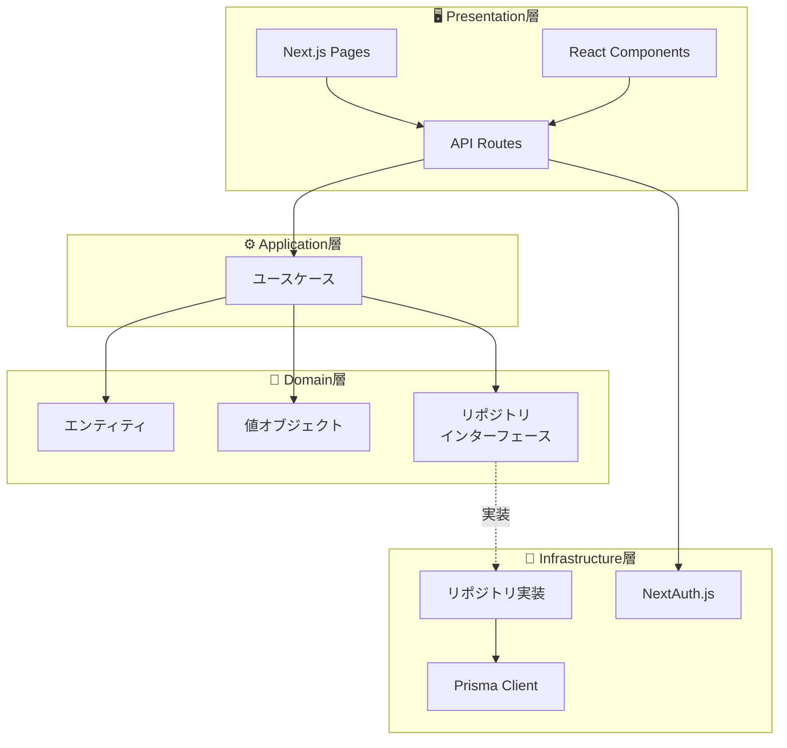

# レイヤー責務

## 概要

Stock Memoはクリーンアーキテクチャに基づき、4つのレイヤーで構成されています。各レイヤーには明確な責務があり、依存関係は常に内側（Domain層）に向かいます。

---

## レイヤー構成図



---

## Domain層

**パス:** `domain/`

### 責務
- ビジネスルールの表現
- エンティティの定義と振る舞い
- 値オブジェクトによる型安全性の確保
- リポジトリインターフェースの定義（実装は持たない）

### 依存関係
- **依存するもの:** なし（最も内側の層）
- **依存されるもの:** Application層、Infrastructure層

### ディレクトリ構成

```
domain/
├── entities/           # エンティティ
│   ├── memo.ts         # メモ
│   ├── stock.ts        # 銘柄
│   └── watchlist-item.ts  # ウォッチリスト
├── value-objects/      # 値オブジェクト
│   ├── stock-code.ts   # 銘柄コード
│   ├── memo-content.ts # メモ内容
│   ├── visibility.ts   # 公開設定
│   ├── dashboard-statistics.ts
│   └── tag-usage.ts
├── repositories/       # リポジトリインターフェース
│   ├── memo-repository.ts
│   ├── stock-repository.ts
│   └── watchlist-repository.ts
└── index.ts           # エクスポート
```

### 設計ガイドライン
- 外部ライブラリへの依存禁止（純粋なTypeScript）
- ビジネスルールはエンティティ内にカプセル化
- 値オブジェクトでプリミティブ型をラップ
- テスト容易性を重視

---

## Application層

**パス:** `application/`

### 責務
- ユースケースの実装（アプリケーション固有のビジネスロジック）
- ドメインオブジェクトのオーケストレーション
- トランザクション境界の管理

### 依存関係
- **依存するもの:** Domain層
- **依存されるもの:** Presentation層

### ディレクトリ構成

```
application/
├── use-cases/
│   ├── create-memo.ts      # メモ作成
│   ├── update-memo.ts      # メモ更新
│   ├── delete-memo.ts      # メモ削除
│   ├── get-memo.ts         # メモ取得
│   ├── list-user-memos.ts  # メモ一覧
│   ├── search-memos.ts     # メモ検索
│   ├── filter-memos-by-tags.ts  # タグフィルタ
│   ├── get-stock.ts        # 銘柄取得
│   ├── search-stocks.ts    # 銘柄検索
│   ├── get-dashboard.ts    # ダッシュボード
│   ├── add-to-watchlist.ts      # ウォッチ追加
│   ├── remove-from-watchlist.ts # ウォッチ削除
│   ├── list-watchlist.ts        # ウォッチ一覧
│   └── check-watchlist.ts       # ウォッチ確認
└── index.ts
```

### ユースケース一覧

| ユースケース | 説明 | 入力 |
|---|---|---|
| `CreateMemoUseCase` | メモ新規作成 | userId, stockCode, content, title?, tags?, visibility? |
| `UpdateMemoUseCase` | メモ更新 | id, userId, title?, content?, tags?, pinned?, visibility? |
| `DeleteMemoUseCase` | メモ削除 | id, userId |
| `GetMemoUseCase` | メモ取得 | id, userId? |
| `ListUserMemosUseCase` | ユーザーのメモ一覧 | userId, page?, limit? |
| `SearchMemosUseCase` | メモ検索 | userId, keyword, page?, limit? |
| `FilterMemosByTagsUseCase` | タグでフィルタ | userId, tags, page?, limit? |
| `GetStockUseCase` | 銘柄取得 | code |
| `SearchStocksUseCase` | 銘柄検索 | query?, page?, limit? |
| `GetDashboardUseCase` | ダッシュボード | userId |
| `AddToWatchlistUseCase` | ウォッチ追加 | userId, stockCode, note? |
| `RemoveFromWatchlistUseCase` | ウォッチ削除 | userId, stockCode |
| `ListWatchlistUseCase` | ウォッチ一覧 | userId |
| `CheckWatchlistUseCase` | ウォッチ確認 | userId, stockCode |

### 設計ガイドライン
- 1ユースケース = 1ファイル
- リポジトリはコンストラクタインジェクション
- Input/Output型を明確に定義
- ユースケースはステートレス

---

## Infrastructure層

**パス:** `infrastructure/`

### 責務
- リポジトリインターフェースの実装
- データベースアクセス（Prisma）
- 外部サービス連携

### 依存関係
- **依存するもの:** Domain層（インターフェース）
- **依存されるもの:** Presentation層

### ディレクトリ構成

```
infrastructure/
├── repositories/
│   ├── prisma-memo-repository.ts
│   ├── prisma-stock-repository.ts
│   └── prisma-watchlist-repository.ts
└── index.ts
```

### 設計ガイドライン
- Prismaスキーマとドメインエンティティの変換を担当
- `reconstruct()`でDBレコードからエンティティを復元
- `toPrimitive()`でエンティティからDBレコードに変換

---

## Presentation層

**パス:** `app/`、`components/`

### 責務
- ユーザーインターフェース（React）
- HTTPリクエスト/レスポンス処理（API Routes）
- 認証・認可の適用
- ユースケースの呼び出し

### 依存関係
- **依存するもの:** Application層、Infrastructure層
- **依存されるもの:** なし（最も外側の層）

### ディレクトリ構成

```
app/
├── api/                    # API Routes
│   ├── auth/[...nextauth]/ # NextAuth.js
│   ├── memos/              # メモAPI
│   ├── stocks/             # 銘柄API
│   ├── watchlist/          # ウォッチリストAPI
│   └── dashboard/          # ダッシュボードAPI
├── dashboard/              # ダッシュボードページ
├── memos/                  # メモ関連ページ
├── stocks/                 # 銘柄関連ページ
├── globals.css             # グローバルスタイル
├── layout.tsx              # ルートレイアウト
└── page.tsx                # ホームページ

components/
├── header.tsx              # ヘッダー
├── providers.tsx           # Context Provider
├── client-layout.tsx       # クライアントレイアウト
├── confirm-modal.tsx       # 確認モーダル
└── watch-button.tsx        # ウォッチボタン
```

### 設計ガイドライン
- API Routesでリポジトリ実装をインスタンス化
- ユースケースをDI（依存性注入）で呼び出し
- 認証はNextAuth.jsで一元管理

---

## 依存性注入パターン

API Routeでのユースケース呼び出し例：

```typescript
// app/api/memos/route.ts

import { CreateMemoUseCase } from "@/application";
import { PrismaMemoRepository } from "@/infrastructure";

export async function POST(request: Request) {
    // リポジトリ実装をインスタンス化
    const memoRepository = new PrismaMemoRepository();
    
    // ユースケースにDI
    const createMemo = new CreateMemoUseCase(memoRepository);
    
    // 実行
    const result = await createMemo.execute({
        userId: session.user.id,
        stockCode: body.stockCode,
        content: body.content,
    });
    
    return Response.json(result);
}
```

---

*参照: [アーキテクチャ概要](./overview.md) | [ドメインモデル](./domain-model.md)*
