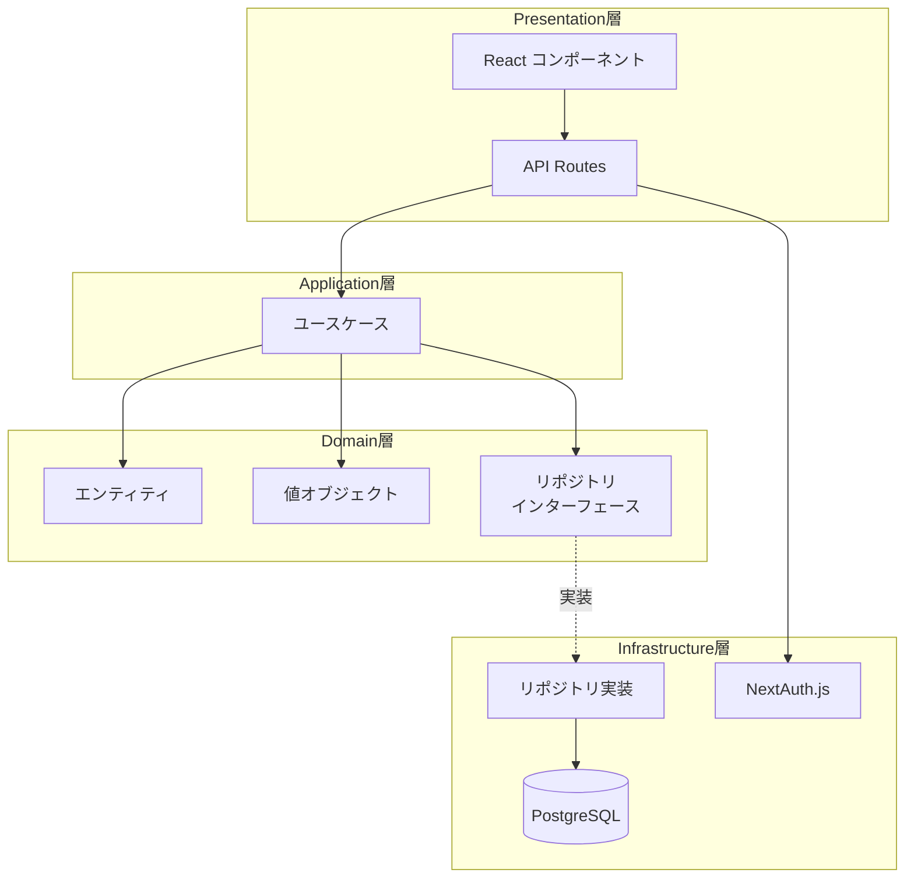
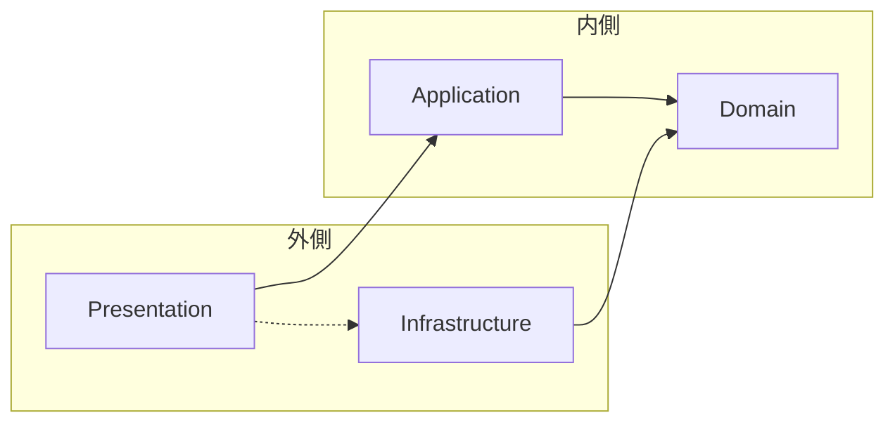

# アーキテクチャ概要

## 設計思想

Stock Memo は**クリーンアーキテクチャ**を採用しています。これにより、ビジネスロジックを外部フレームワーク（Next.js、Prisma等）から独立させ、テスト容易性と保守性を確保しています。

## 技術スタック

| カテゴリ | 技術 |
|---|---|
| **フロントエンド** | Next.js 15 (App Router)、React 19 |
| **スタイリング** | Tailwind CSS 4 |
| **バックエンド** | Next.js API Routes |
| **データベース** | PostgreSQL |
| **ORM** | Prisma |
| **認証** | NextAuth.js |
| **言語** | TypeScript |
| **テスト** | Jest |

---

## 全体構成図



---

## ディレクトリ構成

```
stock-memo/
├── app/                        # Presentation層（Next.js App Router）
│   ├── api/                   # API Routes
│   │   ├── auth/              # 認証エンドポイント
│   │   ├── memos/             # メモ CRUD API
│   │   ├── stocks/            # 銘柄 API
│   │   ├── watchlist/         # ウォッチリスト API
│   │   └── dashboard/         # ダッシュボード API
│   ├── dashboard/             # ダッシュボードページ
│   ├── memos/                 # メモ関連ページ
│   └── stocks/                # 銘柄関連ページ
│
├── components/                 # React コンポーネント
│   ├── header.tsx             # ヘッダー
│   ├── providers.tsx          # Context Provider
│   └── ...
│
├── domain/                     # Domain層（ビジネスロジックの中核）
│   ├── entities/              # エンティティ
│   │   ├── memo.ts            # メモエンティティ
│   │   ├── stock.ts           # 銘柄エンティティ
│   │   └── watchlist-item.ts  # ウォッチリストエンティティ
│   ├── value-objects/         # 値オブジェクト
│   │   ├── stock-code.ts      # 銘柄コード
│   │   ├── memo-content.ts    # メモ内容
│   │   ├── visibility.ts      # 公開設定
│   │   └── ...
│   └── repositories/          # リポジトリインターフェース
│       ├── memo-repository.ts
│       ├── stock-repository.ts
│       └── watchlist-repository.ts
│
├── application/                # Application層（ユースケース）
│   └── use-cases/
│       ├── create-memo.ts
│       ├── update-memo.ts
│       ├── delete-memo.ts
│       ├── search-memos.ts
│       ├── get-dashboard.ts
│       └── ...（14ユースケース）
│
├── infrastructure/             # Infrastructure層（外部サービス実装）
│   └── repositories/          # リポジトリ実装（Prisma）
│       ├── prisma-memo-repository.ts
│       ├── prisma-stock-repository.ts
│       └── prisma-watchlist-repository.ts
│
├── prisma/                     # Prisma設定
│   └── schema.prisma          # データベーススキーマ
│
└── __tests__/                  # テストコード
    ├── domain/                # ドメイン層テスト
    └── application/           # アプリケーション層テスト
```

---

## 依存関係ルール

クリーンアーキテクチャの重要な原則として、**依存は常に内側に向かう**必要があります。



| 層 | 依存できる層 | 依存してはいけない層 |
|---|---|---|
| Domain | なし（最も内側） | Application, Infrastructure, Presentation |
| Application | Domain | Infrastructure, Presentation |
| Infrastructure | Domain | Application, Presentation |
| Presentation | Application, Infrastructure | - |

---

## 各層の責務

詳細は [レイヤー責務](./layers.md) を参照してください。

### Domain層
- ビジネスルールの表現
- エンティティ・値オブジェクトの定義
- リポジトリインターフェースの定義

### Application層
- ユースケース（アプリケーション固有のビジネスルール）
- ドメインオブジェクトのオーケストレーション

### Infrastructure層
- データベースアクセス（Prisma）
- 外部サービス連携
- リポジトリインターフェースの実装

### Presentation層
- ユーザーインターフェース（React）
- HTTPリクエスト/レスポンス処理（API Routes）

---

*関連ドキュメント: [ドメインモデル](./domain-model.md) | [レイヤー責務](./layers.md)*
