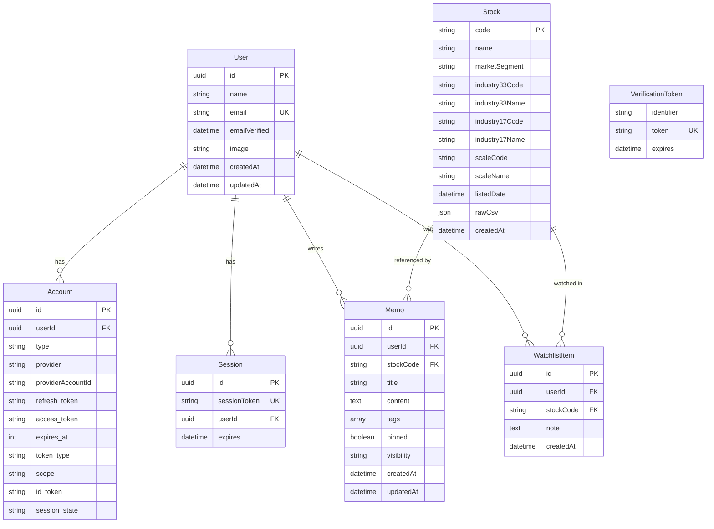

# データベーススキーマ設計

## 概要

Stock Memo は PostgreSQL をデータベースとして使用し、Prisma ORM でアクセスします。

---

## ER図



---

## テーブル定義

### User（ユーザー）

NextAuth.js対応のユーザーモデルです。

| カラム | 型 | 説明 | 制約 |
|---|---|---|---|
| `id` | UUID | 主キー | PK, デフォルト: uuid() |
| `name` | String? | 表示名 | - |
| `email` | String | メールアドレス | UK, NOT NULL |
| `emailVerified` | DateTime? | メール確認日時 | - |
| `image` | String? | プロフィール画像URL | - |
| `createdAt` | DateTime | 作成日時 | デフォルト: now() |
| `updatedAt` | DateTime | 更新日時 | 自動更新 |

---

### Stock（銘柄）

東証銘柄マスタデータを格納します。

| カラム | 型 | 説明 | 制約 |
|---|---|---|---|
| `code` | String | 銘柄コード（例: "7203"） | PK |
| `name` | String | 銘柄名 | NOT NULL |
| `marketSegment` | String? | 市場区分（プライム等） | - |
| `industry33Code` | String? | 33業種コード | - |
| `industry33Name` | String? | 33業種名 | - |
| `industry17Code` | String? | 17業種コード | - |
| `industry17Name` | String? | 17業種名 | - |
| `scaleCode` | String? | 規模コード | - |
| `scaleName` | String? | 規模名（TOPIX Small等） | - |
| `listedDate` | DateTime? | 上場日 | - |
| `rawCsv` | JSON? | 元CSV行データ | - |
| `createdAt` | DateTime | 作成日時 | デフォルト: now() |

**インデックス:**
- `name` - 銘柄名検索用
- `industry33Code` - 業種フィルタ用
- `marketSegment` - 市場フィルタ用

---

### Memo（メモ）

ユーザーが銘柄に対して作成するメモです。

| カラム | 型 | 説明 | 制約 |
|---|---|---|---|
| `id` | UUID | 主キー | PK, デフォルト: uuid() |
| `userId` | UUID | ユーザーID | FK → User.id, NOT NULL |
| `stockCode` | String | 銘柄コード | FK → Stock.code, NOT NULL |
| `title` | String? | タイトル | - |
| `content` | Text | 本文 | NOT NULL |
| `tags` | String[] | タグ配列 | デフォルト: [] |
| `pinned` | Boolean | ピン留め | デフォルト: false |
| `visibility` | String | 公開設定 | デフォルト: "private" |
| `createdAt` | DateTime | 作成日時 | デフォルト: now() |
| `updatedAt` | DateTime | 更新日時 | 自動更新 |

**インデックス:**
- `userId` - ユーザーのメモ一覧取得用
- `stockCode` - 銘柄別メモ取得用
- `createdAt` - 時系列ソート用
- `pinned` - ピン留めフィルタ用

**Visibility値:**
- `"private"` - 非公開（本人のみ閲覧可）
- `"public"` - 公開

---

### WatchlistItem（ウォッチリスト）

ユーザーがウォッチしている銘柄を管理します。

| カラム | 型 | 説明 | 制約 |
|---|---|---|---|
| `id` | UUID | 主キー | PK, デフォルト: uuid() |
| `userId` | UUID | ユーザーID | FK → User.id, NOT NULL |
| `stockCode` | String | 銘柄コード | FK → Stock.code, NOT NULL |
| `note` | Text? | ウォッチ理由メモ | - |
| `createdAt` | DateTime | 作成日時 | デフォルト: now() |

**制約:**
- `(userId, stockCode)` - ユニーク制約（同一銘柄の重複ウォッチ防止）

**インデックス:**
- `userId` - ユーザーのウォッチリスト取得用
- `stockCode` - 銘柄のウォッチ状態確認用

---

### NextAuth.js 認証テーブル

| テーブル | 説明 |
|---|---|
| `Account` | OAuth連携アカウント情報 |
| `Session` | セッション管理 |
| `VerificationToken` | メール認証トークン |

これらはNextAuth.js Prisma Adapterの標準スキーマに準拠しています。

---

## リレーション


| リレーション | 型 | 削除時の動作 |
|---|---|---|
| User → Memo | 1:N | Cascade（ユーザー削除時にメモも削除） |
| User → WatchlistItem | 1:N | Cascade |
| Stock → Memo | 1:N | 参照制約（銘柄削除時はメモが存在する場合エラー） |
| Stock → WatchlistItem | 1:N | 参照制約 |

---

## マイグレーション

```bash
# マイグレーション実行
npm run db:migrate

# スキーマをDBに直接反映（開発用）
npm run db:push

# Prisma Studioでデータ確認
npm run db:studio

# DBリセット（全データ削除）
npm run db:reset
```

---
