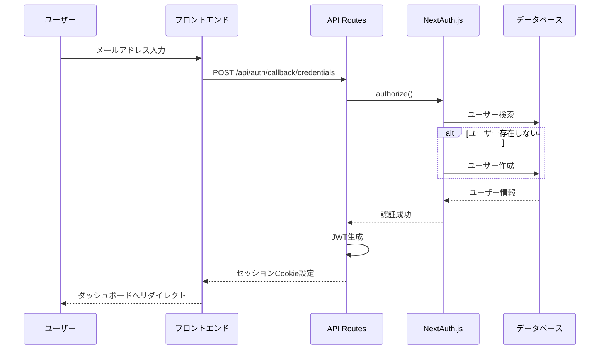

# 認証機能

## 概要

Stock MemoはNextAuth.jsを使用した認証システムを実装しています。現在は開発用にCredentials認証（メールアドレスのみ）を使用していますが、本番環境ではOAuth認証への移行を推奨します。

---

## 技術スタック

| コンポーネント | 技術 |
|---|---|
| 認証ライブラリ | NextAuth.js |
| アダプタ | Prisma Adapter |
| セッション管理 | JWT |
| データベース | PostgreSQL |

---

## 認証フロー



---

## 設定ファイル

### lib/auth.ts

```typescript
import { AuthOptions } from "next-auth";
import { PrismaAdapter } from "@next-auth/prisma-adapter";
import CredentialsProvider from "next-auth/providers/credentials";
import prisma from "@/lib/prisma";

export const authOptions: AuthOptions = {
    adapter: PrismaAdapter(prisma),
    providers: [
        CredentialsProvider({
            name: "メールアドレス",
            credentials: {
                email: { label: "メールアドレス", type: "email" },
            },
            async authorize(credentials) {
                if (!credentials?.email) return null;
                
                // ユーザーを検索または作成
                let user = await prisma.user.findUnique({
                    where: { email: credentials.email },
                });
                
                if (!user) {
                    user = await prisma.user.create({
                        data: {
                            email: credentials.email,
                            name: credentials.email.split("@")[0],
                        },
                    });
                }
                
                return {
                    id: user.id,
                    email: user.email,
                    name: user.name,
                    image: user.image,
                };
            },
        }),
    ],
    session: {
        strategy: "jwt",
    },
    callbacks: {
        async jwt({ token, user }) {
            if (user) token.id = user.id;
            return token;
        },
        async session({ session, token }) {
            if (session.user && token.id) {
                session.user.id = token.id as string;
            }
            return session;
        },
    },
    pages: {
        signIn: "/auth/signin",
    },
    debug: process.env.NODE_ENV === "development",
};
```

---

## セッション管理

### JWT戦略

- セッションはJWTトークンとして管理
- トークンにはユーザーIDが含まれる
- Cookieに保存（HTTPOnly）

### セッション取得方法

**サーバーサイド（API Routes）:**

```typescript
import { getServerSession } from "next-auth";
import { authOptions } from "@/lib/auth";

export async function GET() {
    const session = await getServerSession(authOptions);
    
    if (!session?.user?.id) {
        return Response.json({ error: "認証が必要です" }, { status: 401 });
    }
    
    // session.user.id でユーザーIDにアクセス
}
```

**クライアントサイド:**

```typescript
import { useSession } from "next-auth/react";

function Component() {
    const { data: session, status } = useSession();
    
    if (status === "loading") return <div>Loading...</div>;
    if (status === "unauthenticated") return <div>ログインしてください</div>;
    
    return <div>こんにちは、{session?.user?.name}さん</div>;
}
```

---

## 認可（アクセス制御）

### ドメイン層での権限チェック

メモエンティティ内で権限チェックを実装しています。

```typescript
class Memo {
    // 所有者かどうか確認
    isOwnedBy(userId: string): boolean {
        return this._userId === userId;
    }
    
    // 閲覧可能か確認
    canBeViewedBy(userId: string | null): boolean {
        // 公開メモは誰でも閲覧可能
        if (this._visibility.isPublic) return true;
        // 非公開メモは所有者のみ
        return userId !== null && this.isOwnedBy(userId);
    }
}
```

### API Routesでの認証チェック

```typescript
export async function POST(request: Request) {
    const session = await getServerSession(authOptions);
    
    // 認証チェック
    if (!session?.user?.id) {
        return NextResponse.json(
            { error: "認証が必要です" },
            { status: 401 }
        );
    }
    
    // 認証済みユーザーの処理
}
```

---

## カスタムページ

| ページ | パス | 説明 |
|---|---|---|
| ログイン | `/auth/signin` | カスタムログインページ |

---

## 本番環境への移行

> [!WARNING]
> 現在のCredentials認証は開発用です。本番環境では必ずOAuth認証を使用してください。

### OAuth プロバイダーの追加例

```typescript
import GoogleProvider from "next-auth/providers/google";
import GitHubProvider from "next-auth/providers/github";

export const authOptions: AuthOptions = {
    providers: [
        GoogleProvider({
            clientId: process.env.GOOGLE_CLIENT_ID!,
            clientSecret: process.env.GOOGLE_CLIENT_SECRET!,
        }),
        GitHubProvider({
            clientId: process.env.GITHUB_CLIENT_ID!,
            clientSecret: process.env.GITHUB_CLIENT_SECRET!,
        }),
    ],
    // ...
};
```

### 必要な環境変数

```bash
# Google OAuth
GOOGLE_CLIENT_ID=xxx
GOOGLE_CLIENT_SECRET=xxx

# GitHub OAuth
GITHUB_CLIENT_ID=xxx
GITHUB_CLIENT_SECRET=xxx

# NextAuth
NEXTAUTH_URL=https://your-domain.com
NEXTAUTH_SECRET=your-secret-key
```

---

## 関連ファイル

| ファイル | 説明 |
|---|---|
| `lib/auth.ts` | 認証設定 |
| `app/api/auth/[...nextauth]/route.ts` | NextAuth API Route |
| `app/auth/signin/page.tsx` | ログインページ |
| `components/providers.tsx` | SessionProvider |

---

*参照: [APIエンドポイント仕様](../api/endpoints.md)*
