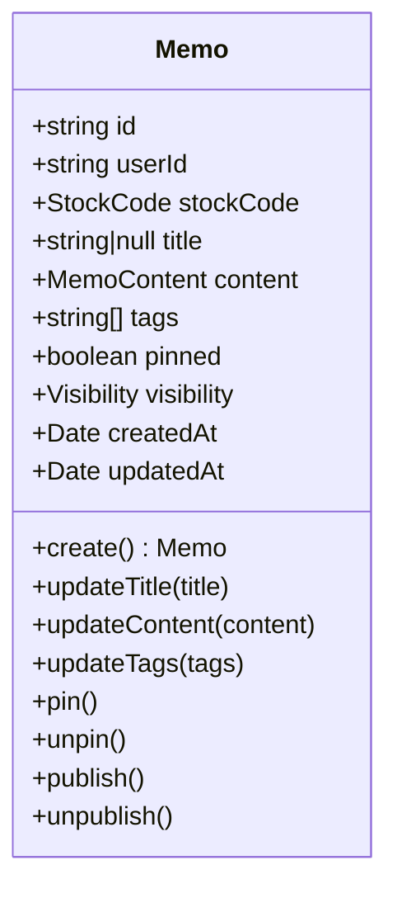
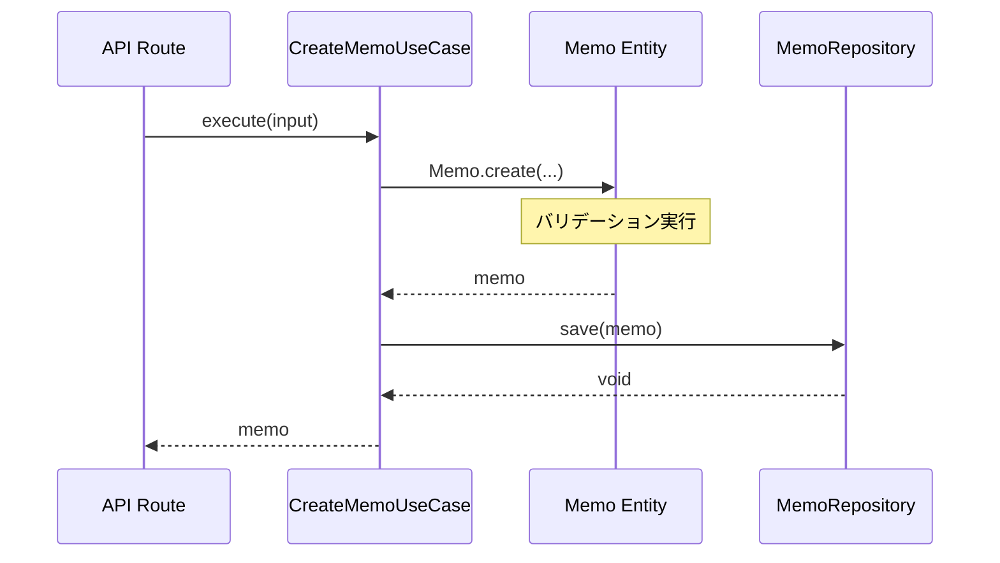
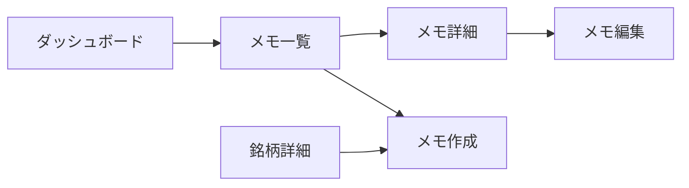

# メモ管理機能

## 概要

メモ管理は Stock Memo の中核機能です。ユーザーは銘柄に対してメモを作成し、タグ付け、ピン留め、公開設定などを行えます。

---

## 機能一覧

| 機能 | 説明 |
|---|---|
| メモ作成 | 銘柄に対してメモを作成 |
| メモ編集 | タイトル、内容、タグを更新 |
| メモ削除 | メモを削除 |
| ピン留め | 重要なメモを上部に固定 |
| タグ付け | メモにタグを付けて分類 |
| 公開設定 | メモを公開/非公開に設定 |
| メモ検索 | キーワードでメモを検索 |
| タグフィルタ | タグでメモをフィルタリング |

---

## データモデル

### Memo エンティティ



### 制約・バリデーション

| 項目 | 制約 |
|---|---|
| 内容（content） | 必須、1〜10,000文字 |
| タイトル（title） | 任意 |
| タグ（tags） | 最大10個 |
| 公開設定 | `"private"` or `"public"` |

---

## ユースケース

### CreateMemoUseCase（メモ作成）



**入力:**
```typescript
interface CreateMemoInput {
    userId: string;
    stockCode: string;  // 4桁の銘柄コード
    content: string;    // 必須、1〜10,000文字
    title?: string;
    tags?: string[];    // 最大10個
    visibility?: "private" | "public";
}
```

---

### UpdateMemoUseCase（メモ更新）

**ビジネスルール:**
- 所有者のみ更新可能
- 更新日時（updatedAt）が自動更新

**入力:**
```typescript
interface UpdateMemoInput {
    memoId: string;
    userId: string;
    title?: string;
    content?: string;
    tags?: string[];
    pinned?: boolean;
    visibility?: "private" | "public";
}
```

---

### DeleteMemoUseCase（メモ削除）

**ビジネスルール:**
- 所有者のみ削除可能

---

### GetMemoUseCase（メモ取得）

**ビジネスルール:**
- 公開メモ: 誰でも閲覧可能
- 非公開メモ: 所有者のみ閲覧可能

---

### SearchMemosUseCase（メモ検索）

キーワードでメモを全文検索します。

**検索対象:**
- メモタイトル
- メモ内容
- 銘柄名
- 銘柄コード

---

### FilterMemosByTagsUseCase（タグフィルタ）

指定したタグを含むメモを取得します。

---

## 画面フロー



---

## タグ機能

### タグの追加

メモ作成・編集時にタグを設定できます。

```typescript
memo.updateTags(["決算", "買い検討", "長期投資"]);
```

### タグによるフィルタリング

```
GET /api/memos?tags=決算,買い検討
```

### タグ統計

ダッシュボードで使用頻度の高いタグを表示します。

```typescript
const topTags = await memoRepository.getTagStatistics(userId, 5);
// [{ tag: "決算", count: 10 }, { tag: "買い検討", count: 5 }, ...]
```

---

## ピン留め機能

重要なメモを上部に固定表示できます。

### ピン留めの切り替え

```typescript
// ピン留め
memo.pin();

// ピン解除
memo.unpin();

// トグル
memo.togglePin();
```

### 表示順序

メモ一覧はピン留めメモが先頭に表示され、その後更新日時順で表示されます。

```sql
ORDER BY pinned DESC, updatedAt DESC
```

---

## 公開設定

### 公開レベル

| 設定 | 説明 |
|---|---|
| `private` | 非公開（所有者のみ閲覧可能） |
| `public` | 公開（誰でも閲覧可能） |

### 公開設定の変更

```typescript
// 公開
memo.publish();

// 非公開
memo.unpublish();
```

### アクセス制御

```typescript
canBeViewedBy(userId: string | null): boolean {
    if (this._visibility.isPublic) return true;
    return userId !== null && this.isOwnedBy(userId);
}
```

---

## API エンドポイント

| メソッド | パス | 説明 |
|---|---|---|
| GET | `/api/memos` | メモ一覧取得 |
| POST | `/api/memos` | メモ作成 |
| GET | `/api/memos/[id]` | メモ詳細取得 |
| PATCH | `/api/memos/[id]` | メモ更新 |
| DELETE | `/api/memos/[id]` | メモ削除 |

詳細は [APIエンドポイント仕様](../api/endpoints.md) を参照してください。

---

## 関連ファイル

| ファイル | 説明 |
|---|---|
| `domain/entities/memo.ts` | Memoエンティティ |
| `domain/value-objects/memo-content.ts` | MemoContent値オブジェクト |
| `domain/value-objects/visibility.ts` | Visibility値オブジェクト |
| `application/use-cases/create-memo.ts` | メモ作成ユースケース |
| `app/api/memos/route.ts` | メモAPI |

---

*参照: [ドメインモデル](../architecture/domain-model.md) | [APIエンドポイント仕様](../api/endpoints.md)*
