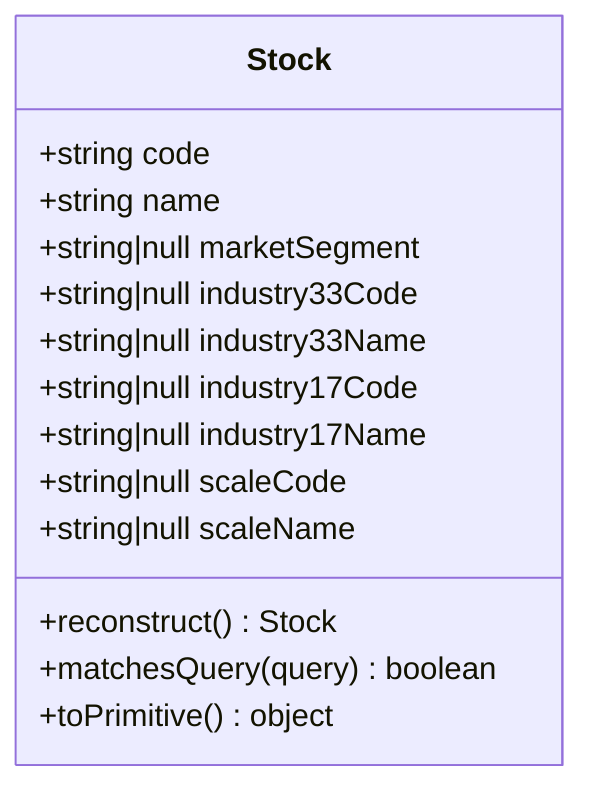
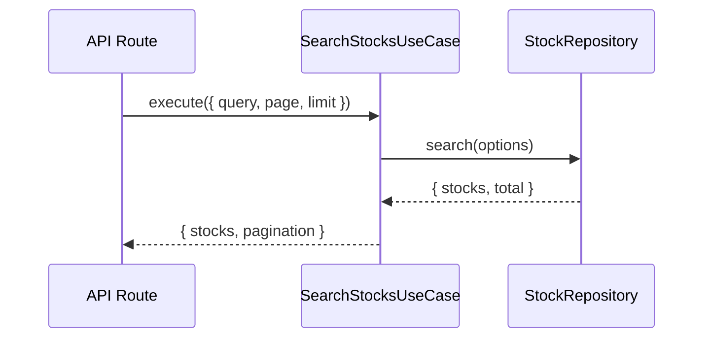

# 銘柄管理機能

## 概要

Stock Memoでは東証上場銘柄のマスタデータを管理し、銘柄検索機能を提供しています。銘柄データはCSVファイルからインポートされます。

---

## 機能一覧

| 機能 | 説明 |
|---|---|
| 銘柄検索 | 銘柄コードまたは銘柄名で検索 |
| 銘柄詳細表示 | 銘柄の詳細情報を表示 |
| 銘柄マスタ管理 | CSVからの銘柄データインポート |

---

## データモデル

### Stock エンティティ



### データ項目

| 項目 | 説明 | 例 |
|---|---|---|
| `code` | 銘柄コード（4桁） | "7203" |
| `name` | 銘柄名 | "トヨタ自動車" |
| `marketSegment` | 市場区分 | "プライム（内国株式）" |
| `industry33Code` | 33業種コード | "3050" |
| `industry33Name` | 33業種名 | "輸送用機器" |
| `industry17Code` | 17業種コード | "12" |
| `industry17Name` | 17業種名 | "自動車・輸送機" |
| `scaleCode` | 規模コード | "1" |
| `scaleName` | 規模区分 | "TOPIX Large70" |

---

## ユースケース

### SearchStocksUseCase（銘柄検索）

銘柄コードまたは銘柄名で検索します。



**入力:**
```typescript
interface SearchStocksInput {
    query?: string;  // 検索クエリ
    page?: number;   // ページ番号（デフォルト: 1）
    limit?: number;  // 件数（デフォルト: 20）
}
```

**検索ロジック:**
- 銘柄コードの部分一致
- 銘柄名の部分一致（大文字小文字区別なし）

---

### GetStockUseCase（銘柄取得）

銘柄コードで銘柄詳細を取得します。

**入力:**
```typescript
interface GetStockInput {
    code: string;  // 銘柄コード
}
```

---

## データソース

### CSVファイル

銘柄データは東証から提供されるCSVファイルからインポートします。

**ファイルパス:** `data/stocks.csv`

### シードスクリプト

```bash
npm run db:seed
```

**処理内容:**
1. CSVファイルを読み込み
2. 既存の銘柄データを全削除
3. CSVデータをパースしてDBに挿入

---

## API エンドポイント

| メソッド | パス | 説明 |
|---|---|---|
| GET | `/api/stocks` | 銘柄一覧・検索 |
| GET | `/api/stocks/[code]` | 銘柄詳細取得 |

### リクエスト例

**銘柄検索:**
```
GET /api/stocks?q=トヨタ&page=1&limit=20
```

**銘柄詳細:**
```
GET /api/stocks/7203
```

詳細は [APIエンドポイント仕様](../api/endpoints.md) を参照してください。

---

## 市場区分

| 区分 | 説明 |
|---|---|
| プライム（内国株式） | プライム市場上場の内国株式 |
| スタンダード（内国株式） | スタンダード市場上場の内国株式 |
| グロース（内国株式） | グロース市場上場の内国株式 |
| ETF・ETN | 上場投資信託・上場投資証券 |
| REIT・インフラファンド | 不動産投資信託等 |

---

## 業種分類

### 33業種分類

東証の33業種分類に対応しています。

| コード | 業種名 |
|---|---|
| 0050 | 水産・農林業 |
| 1050 | 鉱業 |
| 2050 | 建設業 |
| ... | ... |
| 9050 | サービス業 |

### 17業種分類

TOPIX-17業種分類に対応しています。

| コード | 業種名 |
|---|---|
| 1 | 食品 |
| 2 | エネルギー資源 |
| ... | ... |
| 17 | 運輸・物流 |

---

## 規模分類

TOPIX規模別指数に対応しています。

| 規模 | 説明 |
|---|---|
| TOPIX Large70 | 時価総額上位70銘柄 |
| TOPIX Mid400 | 時価総額71〜500位 |
| TOPIX Small 1 | 時価総額501〜1000位 |
| TOPIX Small 2 | 時価総額1001位以下 |

---

## 関連ファイル

| ファイル | 説明 |
|---|---|
| `domain/entities/stock.ts` | Stockエンティティ |
| `domain/value-objects/stock-code.ts` | StockCode値オブジェクト |
| `application/use-cases/search-stocks.ts` | 銘柄検索ユースケース |
| `app/api/stocks/route.ts` | 銘柄API |
| `scripts/seed-stocks.ts` | シードスクリプト |

---

*参照: [ドメインモデル](../architecture/domain-model.md) | [APIエンドポイント仕様](../api/endpoints.md)*
