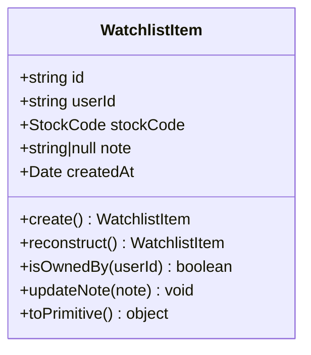
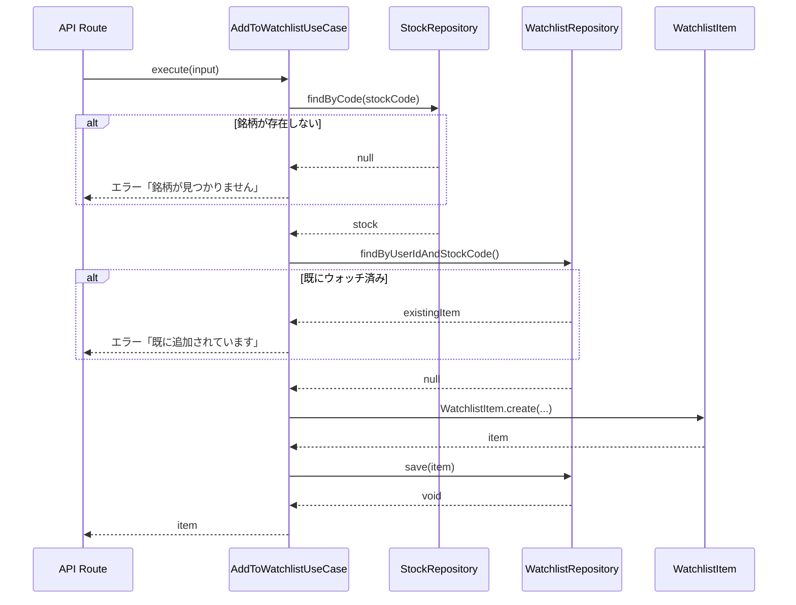
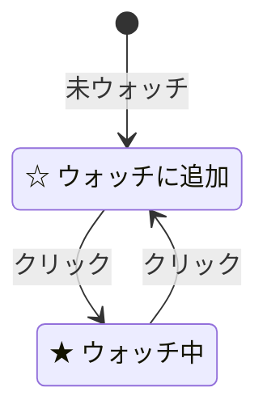
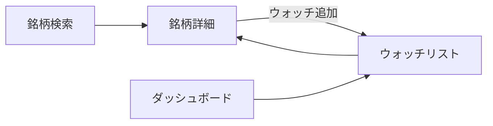

# ウォッチリスト機能

## 概要

ウォッチリスト機能により、ユーザーは気になる銘柄をリストに追加して管理できます。各銘柄にメモを付けることも可能です。

---

## 機能一覧

| 機能 | 説明 |
|---|---|
| ウォッチリスト追加 | 銘柄をウォッチリストに追加 |
| ウォッチリスト削除 | 銘柄をウォッチリストから削除 |
| ウォッチリスト一覧 | ウォッチ中の銘柄一覧を表示 |
| ウォッチ状態確認 | 銘柄のウォッチ状態を確認 |

---

## データモデル

### WatchlistItem エンティティ



### 制約

| 項目 | 制約 |
|---|---|
| ユニーク制約 | `(userId, stockCode)` - 同じ銘柄を重複してウォッチ不可 |
| メモ | 任意、テキスト形式 |

---

## ユースケース

### AddToWatchlistUseCase（ウォッチ追加）

銘柄をウォッチリストに追加します。



**入力:**
```typescript
interface AddToWatchlistInput {
    userId: string;
    stockCode: string;
    note?: string;  // ウォッチ理由メモ
}
```

**エラーケース:**
- 銘柄が存在しない
- 既にウォッチリストに追加されている

---

### RemoveFromWatchlistUseCase（ウォッチ削除）

銘柄をウォッチリストから削除します。

**入力:**
```typescript
interface RemoveFromWatchlistInput {
    userId: string;
    stockCode: string;
}
```

---

### ListWatchlistUseCase（ウォッチ一覧）

ユーザーのウォッチリストを取得します。

**入力:**
```typescript
interface ListWatchlistInput {
    userId: string;
}
```

**出力:**
```typescript
interface WatchlistOutput {
    items: WatchlistItem[];
    total: number;
}
```

---

### CheckWatchlistUseCase（ウォッチ確認）

指定した銘柄がウォッチリストに含まれているか確認します。

**入力:**
```typescript
interface CheckWatchlistInput {
    userId: string;
    stockCode: string;
}
```

**出力:**
```typescript
interface CheckWatchlistOutput {
    isWatching: boolean;
}
```

---

## UI コンポーネント

### WatchButton

銘柄詳細ページで使用するウォッチボタンコンポーネントです。



**機能:**
- ウォッチ状態の表示
- クリックでウォッチ追加/削除
- ローディング状態の表示

---

## API エンドポイント

| メソッド | パス | 説明 |
|---|---|---|
| GET | `/api/watchlist` | ウォッチリスト一覧取得 |
| POST | `/api/watchlist` | ウォッチリストに追加 |
| GET | `/api/watchlist/[code]` | ウォッチ状態確認 |
| DELETE | `/api/watchlist/[code]` | ウォッチリストから削除 |

### リクエスト例

**ウォッチ追加:**
```http
POST /api/watchlist
Content-Type: application/json

{
  "stockCode": "7203",
  "note": "長期投資候補として検討中"
}
```

**ウォッチ削除:**
```http
DELETE /api/watchlist/7203
```

詳細は [APIエンドポイント仕様](../api/endpoints.md) を参照してください。

---

## 画面フロー



---

## 関連ファイル

| ファイル | 説明 |
|---|---|
| `domain/entities/watchlist-item.ts` | WatchlistItemエンティティ |
| `domain/repositories/watchlist-repository.ts` | リポジトリインターフェース |
| `application/use-cases/add-to-watchlist.ts` | ウォッチ追加ユースケース |
| `app/api/watchlist/route.ts` | ウォッチリストAPI |
| `components/watch-button.tsx` | ウォッチボタンコンポーネント |

---

*参照: [ドメインモデル](../architecture/domain-model.md) | [APIエンドポイント仕様](../api/endpoints.md)*
